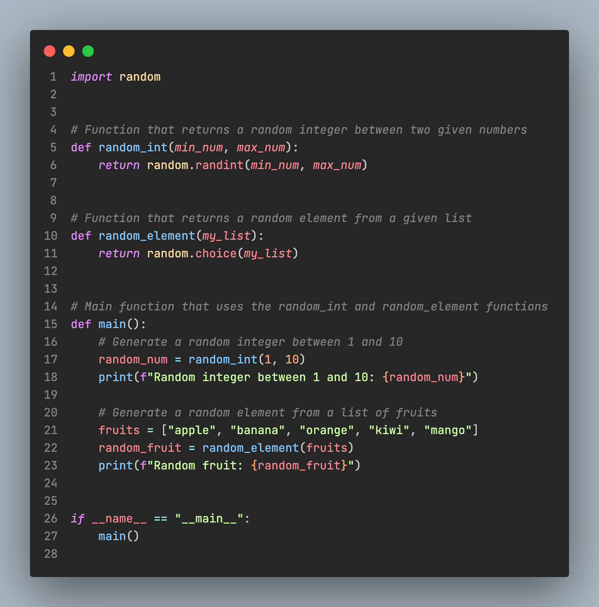

# Dark Theme Zed

A dark theme for Zed (porting of Dark Theme VSCode).

---

## Install ⬇️

1. Open `Command Palette`
2. Select `zed: extensions`
3. Search `Dark Theme Zed`
4. Open `Command Palette`
5. Select `theme selector: toggle`
6. Search `Dark Theme Zed`

---

## Images 🌅

---

## License 📝

MIT © 2012-2024 Scott Chacon and others
